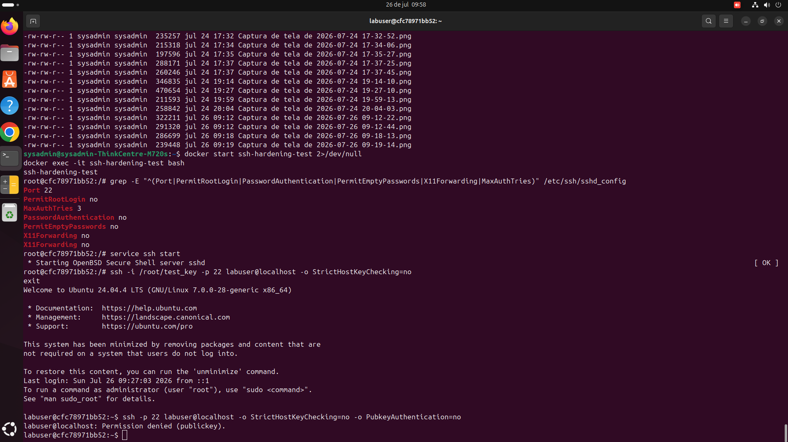

# ssh-hardening

Script que aplica um conjunto de configurações de segurança recomendadas ao `sshd_config`, reduzindo a superfície de ataque de um servidor Linux exposto à internet.

## O que o script faz

| Configuração | Antes (padrão) | Depois | Por quê |
|---|---|---|---|
| `PermitRootLogin` | yes | no | Login root direto via SSH é o alvo #1 de brute-force |
| `PasswordAuthentication` | yes | no | Força autenticação por chave, muito mais resistente a força bruta |
| `PermitEmptyPasswords` | yes | no | Elimina uma falha de configuração comum e grave |
| `X11Forwarding` | yes | no | Reduz superfície de ataque desnecessária em servidor |
| `MaxAuthTries` | 6 | 3 | Limita tentativas de autenticação por conexão |
| `ClientAliveInterval/CountMax` | — | 300/2 | Derruba sessões ociosas automaticamente |
| `Port` | 22 | configurável | Mudar a porta padrão reduz ruído de scanners automatizados (não é segurança real, mas reduz spam de log) |

## Uso

```bash
chmod +x harden_ssh.sh
sudo ./harden_ssh.sh          # mantém porta 22
sudo ./harden_ssh.sh 2222     # muda para porta 2222
```

## ⚠️ Antes de rodar

1. **Garanta que você já tem uma chave SSH configurada** para o seu usuário (`~/.ssh/authorized_keys`). O script desabilita login por senha — se você não tiver uma chave configurada, vai se trancar para fora.
2. **Tenha acesso alternativo** (console da AWS/DigitalOcean, KVM, etc) caso algo dê errado.
3. **Teste em uma nova sessão SSH antes de fechar a atual** — se a nova conexão falhar, você ainda tem a sessão original aberta para reverter.

## Como reverter

O script salva um backup automático em `/etc/ssh/sshd_config.bak.<timestamp>`:

```bash
sudo cp /etc/ssh/sshd_config.bak.<timestamp> /etc/ssh/sshd_config
sudo systemctl restart sshd
```

## Decisões de design

- **Backup automático antes de qualquer alteração** — reversão nunca depende de o usuário lembrar de fazer isso manualmente.
- **Validação com `sshd -t` antes de reiniciar o serviço** — se a config ficar inválida, o script restaura o backup sozinho em vez de derrubar o SSH com uma config quebrada.
- **`set_config()` idempotente** — pode rodar o script mais de uma vez sem duplicar linhas no arquivo de configuração.

## Próxima evolução

Integrar com o `fail2ban-setup` (próximo item do toolkit) para adicionar bloqueio automático de IPs após tentativas falhas.

## Evidência de execução

**Configuração aplicada (destacada em vermelho pelo terminal), seguida de teste de autenticação: login por chave funciona, login sem chave é recusado (`Permission denied (publickey)`):**



**Arquivo `sshd_config` completo após o hardening:** [sshd_config_after.txt](./docs/sshd_config_after.txt)

### Nota técnica

O script foi testado dentro de um container Docker Ubuntu 24.04 isolado (não na máquina host), como prática segura para testar mudanças de configuração de SSH sem risco de perda de acesso. O restart do serviço via `systemctl` (usado pelo script) não funciona dentro do container por não haver `systemd` como processo 1 — nesse ambiente de teste, o restart foi feito manualmente via `service ssh restart`. Em um servidor real com `systemd`, o script funciona de ponta a ponta sem esse ajuste manual.
